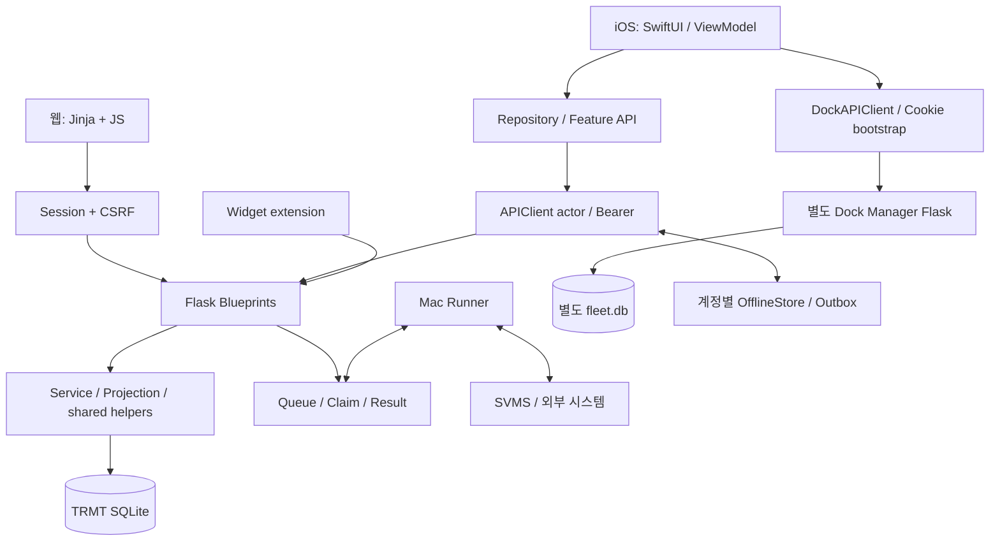

# TRMT 웹·iOS 아키텍처 및 품질 감사 — 2026-09-12

## 1. 요약

TRMT는 **Flask 모듈형 모놀리스 + SQLite + SwiftUI 네이티브 클라이언트** 구조임.
별도 Dock Manager 앱/DB를 WSGI 하위 경로로 묶고, Mac runner가 외부 시스템 작업을
claim/result 방식으로 수행함. 웹/iOS/위젯은 같은 업무 API를 소비하지만 인증 방식,
캐시, 재시도, 화면 수명주기는 각각 다름.

기존 코드에는 계층 테스트, CAS/멱등키, 계정 세대 차단, 금전경로 권한 테스트 등
중요한 보호 장치가 이미 있음. 전체 재작성보다 **기존 HTTP 계약 아래에서 작은
서비스를 추출하고, 여러 소비자의 계약을 함께 검증**하는 접근이 적합함.

이번 실제 제품 코드 변경은 아래 두 가지로 제한함.

1. 웹 단건 SQL 조회가 결과 전체를 Python 객체로 만드는 낭비 제거 및 cursor 해제 보장.
2. iOS 원본/생성형 다운로드의 인증·취소·계정세대 검사 중복 제거.

URL, JSON, 화면 기능, 금액 계산, 권한, 오프라인 자동재전송 범위, DB 스키마는 변경하지 않음.

## 2. 범위와 검증 수준

정본:

- 웹: `/Users/jeonghyejin/projects/teammanagement`
- iOS: `/Users/jeonghyejin/.openclaw/workspace/trmt-mobile/ios/TRMT`

인벤토리 실측: 웹 최상위 Python 33개, 등록 Blueprint 9개, Flask URL rule 490개,
HTML template 34개, `static/js` JavaScript 22개. iOS 앱+위젯 Swift 소스 168개,
Swift 테스트 파일 24개. 서드파티/생성물/업로드/운영 데이터는 소스 범위에서 제외함.
Blueprint 수와 URL rule 수는 `import app`의 실제 등록값임(문자열 검색 추정 아님).

**전량 인벤토리·서버 모듈 경계 검사·iOS 앱/위젯/테스트 전체 컴파일**과 아래 대표
데이터 흐름의 심층 추적을 수행함. 모든 기능의 실기기 수동 E2E, 모든 API의 모든
분기 실행, 운영 부하 테스트까지 완료했다는 의미는 아님. 성능 위험과 실제 운영
지연은 구분하며, 측정하지 않은 p95/개선율/메모리 절감량은 주장하지 않음.

## 3. 아키텍처와 데이터 흐름



### 서버 계층

`app_core → helpers_shared → app → Blueprints`는 낮은 층에서 높은 층 순서임.
실제 import는 높은 층에서 낮은 층으로 내려감. `app`의 Blueprint import는 등록용
예외이며 업무 로직의 순환 의존으로 취급하지 않음. 지원 라이브러리 간 DAG도 테스트됨.

`app_core`가 Flask 객체/설정/DB 연결을 소유하고, `app.py`는 hook·migration·등록과
호환용 재노출을 담당함. 기존 문서의 “app/shared 순환”, “exec 공유 namespace”,
“app.py가 Flask/DB primitive 소유” 설명은 현재 코드와 달라 정정함.

`wsgi.py`는 TRMT와 별도 Dock Manager를 `DispatcherMiddleware`로 합침.
두 DB의 쓰기는 하나의 SQLite transaction이 아님. 따라서 통합 UI라는 이유로
전체가 단일 원장/원자적 처리라고 가정하면 안 됨.

### 주요 기능별 추적 지점

| 기능군 | 서버 / 웹 | iOS / 데이터 경계 |
|---|---|---|
| 인증·권한 | `app.py`, `token_auth.py`, `helpers_shared.py`, `csrf.py` | `AuthStore`, Keychain, APIClient context generation |
| 현안·대시보드·선대 | `routes_core.py`, `routes_tail.py`, `app.js` | Daily/Dashboard ViewModel, Repository, Fleet/Issue 모델 |
| 검선·선급 | `ai_gemini.py`, `routes_core.py`, `routes_tail.py`, `vt.js`, `cs.js` | SurveyViewModel, Survey 모델, widget projection |
| 일정·출장·비용 | `calendar_service.py`, `routes_calendar_dock.py` | Calendar/Expenses ViewModel, Repository |
| 완료보고서 | report projection/export service, `bre.js`, `dde.js` | ReportsAPI, Report list/detail/editor ViewModel |
| 입거 Daily | `routes_dock_daily.py`, `dock_daily.js`, 문서 parser/export | DockDailyReportAPI/모델/편집 ViewModel |
| Dock 프로젝트·조달·수리 | `drydock_integration.py`, `routes_dock_submit.py`, `routes_repair_request.py` | DockAPIClient, DockNative/DockProcure/RepairRequest |
| 결재·자동화·LISCR | worker API, 상태전이/claim/result, `routes_liscr.py` | Approvals/Automation/Liscr ViewModel, 수동 실행 경계 |
| 우리자산 | `routes_family_assets.py`, household/revision transaction | FamilyAssetsViewModel, 동기화 정책, 금융 표시/잠금 |
| 첨부·오프라인·위젯 | 파일 endpoint, client idempotency, widget projection | AttachmentCache, OfflineStore, Outbox, TRMTWidget |

읽기는 JSON → Codable → MainActor 상태로 전달됨. 계정 변경 후 늦은 응답은
APIClient generation으로 폐기하며, Dock bootstrap은 별도 epoch/단일실행 상태를 가짐.
오프라인 보관은 명시적으로 허용된 쓰기만 대상이고, 원래 멱등키가 서버 재전송까지
유지됨. 로그아웃 시 읽기캐시는 지우지만 같은 계정의 미전송 입력은 보존함.
이 동작은 품질 개선 과정에서 유지해야 할 기능 계약임.

## 4. 문제 구간과 우선순위

### Q1 — 공용 단건 조회의 불필요한 전체 materialization [수정]

- 근거: `app_core.py:query`가 `one=True`에도 `fetchall()` 후 첫 행만 반환했음.
- 영향: 여러 행이 매칭되는 호출에서 Python Row/list 할당이 결과 수에 비례함.
  PK/COUNT처럼 원래 한 행만 나오는 조회의 속도 개선은 제한적임.
- 개선: `fetchone()` 분기, `finally: cursor.close()`.
- 증명: 실제 SQLite 1,000행 fixture에서 단건 조회 row factory 호출은 1회;
  첫 행/빈 결과/전체 결과/정렬/파라미터 계약 유지, decode 예외 후 table lock 해제 확인.
- 한계: SQL 자체의 full scan/sort를 없앤 것이 아님. 쿼리 계획 최적화와 구분해야 함.

### Q2 — iOS 다운로드 인증·오류 생명주기 중복 [수정]

- 근거: `APIClient.swift`의 `downloadData`와 `downloadFile`이 URL 작성, Bearer,
  URLSession 호출, 취소 판정, generation 검사, 401 처리를 각각 구현했음.
- 위험: 계정전환/취소 수정이 한 경로에만 들어가면 첨부와 보고서 동작이 달라짐.
- 개선: private `downloadResponse`로 공유. JSON 요청의 캐시/Outbox 로직과는 합치지 않음.
- 중요 차이 보존: 원본 다운로드 HTTP 오류 body는 `nil`; 생성형 파일은 raw body 유지.
  filename*=UTF-8 우선, fallback, basename 정리, 사용자 지정 timeout도 유지함.
- 신규 계약: binary bytes, auth/query, 한글/경로탈출/세미콜론 파일명, HTTP body 차이,
  401 callback, cancel/transport, 늦은 성공/401 응답의 계정 경계 차단.

### Q3 — 현재 코드와 아키텍처 문서 불일치 [수정]

- 근거: 이전 `ARCHITECTURE.md`는 이미 제거된 exec/shared 순환과 이전 테스트 이름을
  현재 구조로 설명하고, family-assets 및 iOS/worker 데이터 흐름을 빠뜨렸음.
- 영향: 신규 엔지니어가 이미 끝난 모듈 분리를 다시 시도하거나 허용되지 않은 import를
  정상 패턴으로 오인할 수 있음.
- 개선: 실제 `app_core` 계층/테스트명/9개 Blueprint/2개 DB/클라이언트 흐름으로 갱신.

### Q4 — URL 계약 fixture가 정본 라우트를 따라오지 못함 [수정]

- 실행 근거: `test_url_map_contract_snapshot` 실패. 기존 fixture 486개, 정본 490개.
- 누락만 4개이며 삭제/다른 필드 변경은 없음:
  `/api/ext/remittance/drafts` POST, `/api/remittance/drafts` GET,
  `/remittance` GET, `/dock-manager` GET.
- 이 감사의 제품 변경은 URL 등록 코드를 건드리지 않았으므로 기존 drift임.
- 개선: route의 권한/응답 목적을 확인한 뒤 **이 4개만** fixture에 명시적으로
  등재함. 전체 snapshot 자동 재생성으로 차이를 숨기지 않았고 route/HTML gate를 재실행함.
  remittance 3개 rule/method는 money guard 토큰·정적/런타임 정책 fixture에도 추가해
  anonymous/non-admin 거부와 거부 요청의 DB 무변경을 기존 돈경로와 동일하게 고정함.

### Q5 — 책임이 과도하게 집중된 모듈 [구조적 유지보수 위험]

- 근거: `routes_calendar_dock.py` 7,709줄에 212개 URL rule,
  `helpers_shared.py` 2,670줄, `routes_dock_daily.py` 3,876줄.
  iOS `FamilyAssetsView.swift` 1,766줄, `DockDailyReportView.swift` 1,604줄,
  `DockDailyReportViewModel.swift` 1,272줄, `Repository.swift` 848줄(감사 시작 시점).
- 위험: 파일명과 도메인 불일치, 변경 충돌, 리뷰 범위 확장, 상태전이/UI/전송 정책의
  동시 수정 가능성. 줄 수만으로 장애라고 판단하는 것은 아님.
- 전략: 기존 route 함수를 HTTP adapter로 유지한 채 domain service/projection 추출.
  iOS는 presentation/순수 변환/편집 상태전이를 View에서 분리하고, feature API는
  transport actor를 그대로 공유. 금전/외부발송 상태기계는 별도 계약 확보 후 마지막.

### Q6 — 요청 thread 내 장시간 PDF 변환 [성능 위험, 운영 부하 미측정]

- 근거: `report_export_service.py:pdf_response`가 `subprocess.run(timeout=120)`을
  동기 실행함. `deploy/trmt.service`는 Gunicorn worker 1개/gthread 8개 구성임.
- 영향: 변환 요청은 완료까지 thread를 점유하므로 동시 export 증가 시 다른 API의
  대기 시간을 늘릴 수 있음. 현재 운영 장애/120초 강제 worker kill을 의미하지 않음.
- 전략: 먼저 export 동시성/큐 대기/p95/메모리 측정. 이후 동시성 제한이나 입력 revision
  기반 결과 캐시 검토. 비동기 job API는 클라이언트 계약 변화이므로 이번에는 적용하지 않음.

### Q7 — iOS 파일 import에서 크기검사 전에 동기 전체 읽기 [성능 위험]

- 근거: `Sources/Common/AttachmentKit.swift` fileImporter 성공 콜백에서
  `Data(contentsOf:)` 이후에 20MB 제한 검사함. `DockAdvancedViews.swift`에도 유사 코드가 있음.
- 영향: 제한보다 큰 파일도 먼저 메모리에 읽고 버림. provider I/O가 UI 콜백을 오래
  점유할 수 있음. 실기기 hang 시간/RSS는 아직 측정하지 않음.
- 전략: security-scoped URL 접근 수명을 유지하는 독립 파일 loader로 통합;
  metadata 선검사 + bounded read + 실제 bytes 재검증. importer 취소/권한/provider
  오류와 기존 안내문을 보존하는 실기기 테스트 후 적용.

### Q8 — permissive decoding이 계약 실패를 빈 목록으로 보일 수 있음 [유지보수 위험]

- 근거: `DockDailyReportAPI.swift:ProjectsResponse/ReportsResponse`는 여러 shape를
  `try?`로 시도한 뒤 `[]`로 fallback함.
- 영향: 잘못된 element 타입/서버 schema drift가 decoding error 대신 “목록 없음”으로
  표시될 수 있음. 여러 배포 버전 호환을 위한 의도도 있으므로 무조건 삭제하면 안 됨.
- 전략: 실제 지원 shape를 fixture로 열거하고, envelope 부재와 element 손상을 구분하는
  계약부터 정의. 오류 표시 방식이 바뀔 수 있어 이번 기능불변 패치에서는 유지함.

### Q9 — Vetting N+1 [기존 허용된 절충, 규모 증가 시 재측정]

- 근거: `helpers_shared.py:_vetting_with_counts`는 행마다 findings GROUP BY와
  attachment COUNT 2개 쿼리를 실행. `_vetting_pick`, `ai_gemini.py:api_vettings_list`,
  widget/ext digest 경로가 소비함.
- 기존 결정: `routes_core.py:681`에 담당선 규모에서 부담이 없고 manual override
  정합성이 우선이라는 허용 사유가 명시되어 있음. 이번에 긴급 문제로 재분류하지 않음.
- 향후 필요 시: SQL 집계만 batch하고 manual count/Next Plan/표시 순서의 순수 projection을
  공유. 기능별 숫자를 따로 재계산하는 최적화는 금지. 운영 규모가 커진 뒤 측정으로 결정.

## 5. 적용한 개선 코드

```python
def query(sql, params=(), one=False):
    cur = get_db().execute(sql, params)
    try:
        return cur.fetchone() if one else cur.fetchall()
    finally:
        cur.close()
```

```swift
func downloadData(_ path: String, query: [URLQueryItem] = []) async throws -> Data {
    let (data, _) = try await downloadResponse(path, query: query, includeErrorBody: false)
    return data
}
// downloadFile uses the same transport with includeErrorBody: true,
// then preserves the existing filename parsing and sanitization policy.
```

실제 전체 구현/회귀 검사는 `app_core.py`, `tests/test_db_query_contract.py`,
`APIClient.swift`, `Tests/APIClientContractTests.swift`에 있음.

## 6. 리팩터링 순서와 완료 기준

1. **현재 계약부터 복구:** URL fixture drift 명시 수정 완료, 문서 정본화, 코드/계약 테스트를
   함께 변경하는 리뷰 관행 적용. URL/method/auth/JSON 변화는 별도 변경으로 보이게 유지.
2. **읽기 서비스 추출:** calendar/report의 기존 추출 패턴을 다른 읽기 projection으로 확장.
   DB fixture 응답 equality + query count로 기능/효율 검증; auth는 adapter에 보존.
3. **iOS 경계 정리:** 독립 file loader, display projection, feature repository protocol을
   순차 도입. singleton 전체 교체 대신 새/변경 ViewModel의 dependency injection부터 적용.
4. **계측 후 성능 투자:** 대용량 첨부, 동시 PDF, 목록 크기별 latency/RSS/쿼리 수 측정.
   자료 없이 캐시 TTL/페이지 제한/worker 수를 바꾸지 않음.
5. **복잡한 쓰기는 마지막:** 결재/외부전송/다중 DB/오프라인 상태전이의 충돌·재시도·
   unknown result 계약을 먼저 고정하고, 독립 리뷰와 최종 상태 검증 후 분리.

## 7. 검증 결과와 미결

- 웹 신규 DB 계약 3개, 모듈경계 10개, runtime hardening 6개 통과.
- HTML GET 및 error-template 스모크 2개 통과.
- Money guard 8개, money bulk 12개, CSRF 25개, client idempotency 12개 통과.
- URL snapshot의 기존 누락 4개를 명시적으로 등재했고 계약 테스트가 통과함.
- 시스템 Python 3.14에는 Flask가 없어서 최초 discovery 실패. 기존 정본
  `.venv-test/bin/python`으로 위 결과를 확인함.
- iOS: XcodeGen 후 generic iOS Simulator `build-for-testing` exit 0.
  앱/위젯/전체 테스트 target 및 신규 다운로드 계약 6개가 컴파일됨.
- iOS 실행 시도: iOS 26.5 simulator가 `simctl` 목록에 있지만 Xcode destination에
  구체 기기가 노출되지 않아 `xcodebuild test` exit 70. **테스트 실행 통과로 보고하지 않음.**
- 운영 서비스/외부전송/금전/스키마를 직접 변경하지 않음. commit/push/deploy/라이브
  검증은 이 코드감사 작업자의 실행 범위가 아니며 별도 출하 단계에서 확인해야 함.

확신도: 실제 코드 구조·중복·단건 materialization·컴파일 결과는 높음.
운영 병목의 빈도/체감 영향은 부하·실기기 측정 전까지 미확정임.
